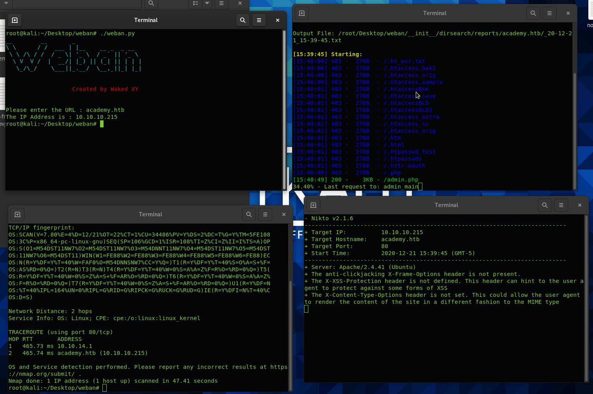

****i guys , I share with you a simple script that I developed in order to automate the scan and reports generation of the following tools during a Web Application Pentest: Nmap , Nikto and Dirsearch.
I hope you enjoy the tool!***

**Before installing :**
- sudo pip3 install art
- sudo apt-get install gnome-terminal

**How to install :**
- sudo git clone https://github.com/wakedxy/weban.git
- sudo chmod +x weban.py  
- sudo chmod +x __init__/dirsearch/dirsearch.py
